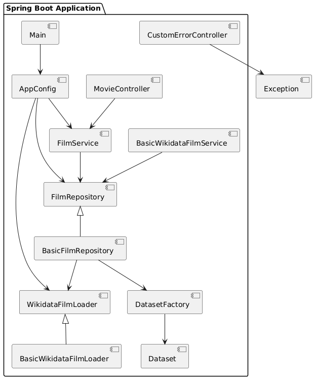
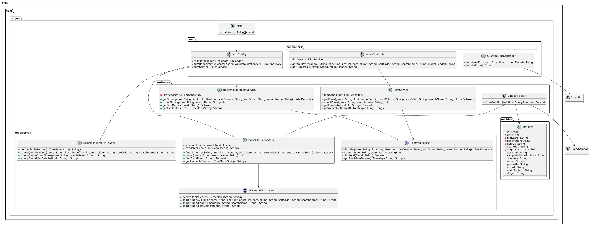

# Проект "Система для роботи з фільмами з Wikidata"

Цей проект реалізує систему для отримання та обробки інформації про фільми з використанням даних з Wikidata. Система
підтримує фільтрацію, сортування, пагінацію та пошук за назвами фільмів.
Інтерфейс доступу до даних побудований через API Wikidata, і результати надаються у вигляді об'єктів, які можна
використовувати в подальших процесах, таких як відображення на веб-сторінці.

## Як це працює

Застосунок надає доступний API, через який, як сторонні сервіси так і користувачі застосунку, можуть отримувати
інформацію про фільми.
API підтримує GET-запити для отримання списку фільмів, пошуку фільмів за назвою, отримання жанрів і детальної інформації
про фільм за його ідентифікатором.
<br><br>
Користувач може звертатися до цієї системи через веб-інтерфейс, де йому надається можливість взаємодіяти з фільмами,
обираючи параметри для пошуку та фільтрації.

## Компоненти проекту


Проект розроблений з урахуванням принципів чистої архітектури, що дозволяє розділяти різні обов'язки між окремими шарами
для підвищення масштабованості, тестованості та підтримуваності. Чиста архітектура передбачає чітке розділення між
рівнями абстракції, що дозволяє мінімізувати зв'язок між ними та робить систему більш гнучкою до змін.

Проект побудований за принципами чистої архітектури з розділенням обов'язків між різними шарами:



1. ### Репозиторій FilmRepository
   FilmRepository — це інтерфейс, який визначає операції для взаємодії з даними про фільми, забезпечуючи абстракцію для
   доступу до джерела даних.<br><br>
   Основна мета цього інтерфейсу — дозволити сервісам і класам, які взаємодіють з даними, абстрагуватися від конкретної
   реалізації взаємодії з джерелом даних, що дозволяє легше змінювати або заміняти джерело даних, не впливаючи на інші
   частини програми.<br><br>

   Методи цього інтерфейсу включають:

    * findAll — дозволяє отримати список фільмів, що відповідають певним критеріям, таким як жанр, ліміти на кількість,
      сортування тощо. Результат — це список об'єктів типу Dataset, який містить дані про фільми, що задовольняють
      зазначені умови.
    * count — підраховує кількість фільмів, що відповідають заданим критеріям (жанр, назва). Цей метод корисний для
      реалізації пагінації, оскільки допомагає визначити, скільки всього елементів відповідає запиту, і таким чином
      можна визначити кількість сторінок для пагінації.
    * findById — використовується для отримання детальної інформації про конкретний фільм за його ідентифікатором. Цей
      метод повертає один об'єкт Dataset, що містить всю необхідну інформацію про фільм.
    * getAvailableGenres — повертає список доступних жанрів фільмів, які можна використовувати для фільтрації
      результатів пошуку. Це може бути корисно, якщо потрібно запропонувати користувачеві список можливих жанрів для
      вибору при фільтрації фільмів.

    ```java
    public interface FilmRepository {
        List<Dataset> findAll(String genre, int limit, int offset, String sortColumn, String sortOrder, String searchName);
        int count(String genre, String searchName);
        Dataset findById(String filmId);
        TreeMap<String, String> getAvailableGenres();
    }
    ```
   Параметри:
    * genre — визначає, які жанри фільмів повинні бути включені до результатів пошуку. Якщо значення "all", то всі жанри
      будуть включені. Це дозволяє фільтрувати фільми за певними категоріями (наприклад, "комедія", "драма", "бойовик").
    * limit — максимальна кількість фільмів, яку потрібно повернути. Це корисно для обмеження кількості результатів,
      наприклад, при пагінації.
    * offset — визначає, з якого індексу почати вибірку, що дозволяє реалізувати пагінацію (відсутність цього параметра
      може призвести до отримання всіх результатів відразу).
    * sortColumn — колонка, за якою буде здійснюватися сортування результатів (наприклад, за датою виходу фільму або за
      алфавітним порядком).
    * sortOrder — напрямок сортування, що визначається як "asc" (по зростанню) або "desc" (по спаданню).
    * searchName — частина назви фільму, за якою здійснюється пошук. Це дозволяє здійснити пошук фільмів, де назва
      містить заданий фрагмент.

2. ### Репозиторій BasicFilmRepository
   Клас BasicFilmRepository реалізує інтерфейс FilmRepository. Цей клас є зручною обгорткою для іншого класу для того,
   щоб зручно будувати запити та отримувати результат від wikidata ендпоинту. <br> <br>
   Один з ключових моментів — це динамічне формування запитів на основі вхідних параметрів. Наприклад, якщо користувач
   хоче отримати фільми певного жанру, за певною назвою або в певному порядку, ці параметри автоматично додаються до
   запиту.

   Приклад: метод для знаходження фільмів за критеріями — отримує критерії, робить їх зручними для читання SPARQL запиту
   та передає їх далі для створення запиту
   ``wikidataLoader.sparqlQueryAllFilms(genre, limit, offset, sparqlSortColumn, sparqlOrder, searchName)``.
    ```java
   @Override
   public List<Dataset> findAll(String genre, int limit, int offset, String sortColumn, String sortOrder, String searchName) {
       String sparqlSortColumn = mapColumnToSparql(sortColumn);
       String sparqlOrder = sortOrder.equals("asc") ? "ASC" : "DESC";

       Query query = QueryFactory.create(wikidataLoader.sparqlQueryAllFilms(genre, limit, offset, sparqlSortColumn, sparqlOrder, searchName));

       List<Dataset> movies = new ArrayList<>();
       try (QueryExecution queryExecution = QueryExecutionHTTP.service(WIKIDATA_ENDPOINT, query)) {
           ResultSet results = queryExecution.execSelect();
           while (results.hasNext()) {
               QuerySolution solution = results.next();
               movies.add(DatasetFactory.fromSolution(solution));
           }
       }
       return movies;
   }
   ```
   Для виконання сформованих SPARQL-запитів, метод використовує бібліотеку Apache Jena, яка є стандартним інструментом
   для роботи з SPARQL-ендпоїнтами. За допомогою цієї бібліотеки клас може підключитися до SPARQL-сервера Wikidata
   ``QueryExecutionHTTP.service(WIKIDATA_ENDPOINT, query))`` і отримати дані у зручному форматі для їх обробки.

3. ### Клас WikidataFilmLoader
   Клас WikidataFilmLoader є ключовим компонентом у проекті, який відповідає за взаємодію з зовнішнім сервісом Wikidata.
   Його основною задачею є формування SPARQL-запитів для отримання даних про фільми з Wikidata. Цей клас дозволяє
   отримувати різну інформацію, таку як список фільмів, жанри, кількість фільмів, а також детальну інформацію про окремі
   фільми. <br><br>

   Приклад SPARQL запиту

    ```SPARQL
    SELECT ?film ?filmLabel ?description ?posterUrl
    (GROUP_CONCAT(DISTINCT ?genreLabel; separator=", ") AS ?genres)
    (SAMPLE(YEAR(?publicationDate)) AS ?samplePublicationDate)
    (SAMPLE(?ratingLabel) AS ?rating)
    WHERE {
    ?film wdt:P31 wd:Q11424;
    wdt:P495 wd:Q212;
    wdt:P136 ?genre;
    wdt:P577 ?publicationDate.
    ?film rdfs:label ?filmLabel.
    FILTER(LANG(?filmLabel) = "uk")
    FILTER(CONTAINS(LCASE(STR(?filmLabel)), LCASE("%s")))
    
        OPTIONAL {
            ?film wdt:P136 ?genre;
                  ?genre rdfs:label ?genreLabel.
            FILTER(LANG(?genreLabel) = "uk")
        }
    
        OPTIONAL {
            ?film schema:description ?description.
            FILTER(LANG(?description) = "uk")
        }
    
        OPTIONAL { ?film wdt:P444 ?ratingLabel. }
        OPTIONAL { ?film wdt:P18 ?posterUrl. }
        FILTER(YEAR(?publicationDate) > 0)
    }
    GROUP BY ?film ?filmLabel ?description ?posterUrl
    ORDER BY %s(%s)
    LIMIT %d
    OFFSET %d
    ```

   Преамбула запиту включає визначення префіксів, які використовуються для скорочення URI в запитах. Ці префікси
   дозволяють зручніше звертатися до властивостей і класів, що використовуються в Wikidata.

   Основні префікси, які використовуються в запиті:
    * wdt: — для доступу до властивостей з прямими значеннями (наприклад, жанр, країна, дата публікації).
    * wd: — для доступу до ресурсів, що описують конкретні елементи (наприклад, фільми, жанри або режисери).
    * rdfs: — для роботи з метаданими, такими як назви або описи.
    * schema: — для доступу до структурованих даних, таких як описи або зображення.
    * wikibase: — для використання специфічних властивостей Wikidata.
    * bd: — для роботи з певними спеціальними властивостями, зокрема для обробки великих даних.

   #### Запит SELECT
   Це основна частина запиту, яка визначає, які саме дані потрібно отримати:

    * ?film — ідентифікатор фільму.
    * ?filmLabel — назва фільму.
    * ?description — опис фільму (опційно).
    * ?posterUrl — URL зображення постера фільму (опційно).
    * ?genres — список жанрів фільму, що групуються в одну строку через роздільник.
    * ?samplePublicationDate — рік публікації фільму (опційно).
    * ?rating — рейтинг фільму (опційно).

   #### Умови WHERE
   Це частина запиту, яка визначає фільтри та умови для вибору конкретних фільмів:

   ?film wdt:P31 wd:Q11424; — фільм має бути екземпляром ресурсу "фільм" (Q11424 у Wikidata).
    * wdt:P495 wd:Q212; — фільм має бути знятий в Україні (Q212 — країна Україна).
    * wdt:P136 ?genre; — фільм має належати певному жанру.
    * wdt:P577 ?publicationDate. — фільм має дату публікації.
    * Після цього в запиті йдуть додаткові фільтри для зв'язування жанрів, опису фільмів та інших характеристик.

   #### Фільтри на мову та назву
    * FILTER(LANG(?filmLabel) = "uk") — фільми фільтруються за мовою, і використовуються лише фільми з українськими
      назвами.
    * FILTER(CONTAINS(LCASE(STR(?filmLabel)), LCASE("%s"))) — частковий пошук фільму за назвою, де %s є значенням з
      вхідного параметра searchName. Це дозволяє знаходити фільми, назви яких містять задану підрядку.

   #### Отримання додаткової інформації, якщо вона є:

    * OPTIONAL { ?film wdt:P136 ?genre; ?genre rdfs:label ?genreLabel. } — фільми можуть мати жанри, які додаються до
      результату.
    * OPTIONAL { ?film schema:description ?description. } — фільм може мати опис, який додається до результату.
    * OPTIONAL { ?film wdt:P444 ?ratingLabel. } — фільм може мати рейтинг.
    * OPTIONAL { ?film wdt:P18 ?posterUrl. } — фільм може мати URL зображення постера.
    * Групування (GROUP BY)

   За допомогою групування всі жанри фільмів, а також інші характеристики (такі як країна, компанія, нагороди)
   об'єднуються в один рядок за допомогою функції GROUP_CONCAT. Це дозволяє отримати всі жанри фільму в одному полі,
   навіть якщо їх кілька.
   Наприклад:

   #### Запит використовує два параметри для обмеження результатів:

   LIMIT %d — обмежує кількість отриманих фільмів (параметр limit).
   OFFSET %d — забезпечує пагінацію, пропускаючи певну кількість записів (параметр offset).

4. ### Сервіс FilmService
   Сервіс FilmService реалізує бізнес-логіку для обробки запитів, пов'язаних з фільмами. Його основне завдання — це
   координація взаємодії між контролерами, які відповідають за прийом запитів від користувачів, і репозиторіями, що
   безпосередньо працюють з даними фільмів. Сервіс виступає як абстракція, що забезпечує зручний інтерфейс для інших
   частин системи для взаємодії з фільмами, не зважаючи на те, як саме ці дані отримуються або зберігаються.

   Основні методи сервісу:

    * Метод getFilms: Цей метод відповідає за отримання списку фільмів відповідно до різних параметрів фільтрації,
      сортування, пагінації та пошуку. Користувач може вказати жанр, обмеження на кількість фільмів (параметр limit),
      зміщення для пагінації (offset), критерій сортування за колонкою та порядком сортування (параметри sortColumn і
      sortOrder), а також частину назви фільму для пошуку через параметр searchName. Після отримання цих параметрів
      сервіс викликає метод findAll репозиторія, який формується відповідно до отриманих критеріїв. Це дозволяє
      користувачу ефективно шукати фільми за різними параметрами, такими як жанр, назва або інші властивості.
      ```java
      public List<Dataset> getFilms(String genre, int limit, int offset, String sortColumn, String sortOrder, String searchName) {
      return filmRepository.findAll(genre, limit, offset, sortColumn, sortOrder, searchName);
      }
      ``` 
      Наприклад, якщо користувач хоче знайти фільми жанру "комедія", відсортовані за датою випуску, з обмеженням в 10
      фільмів і зміщенням на 20 фільмів, то цей метод сформує відповідний запит до репозиторія, який буде виконаний і
      поверне відповідні результати.

    * Метод countFilms: Даний метод виконує підрахунок кількості фільмів, які відповідають певним критеріям фільтрації.
      Наприклад, якщо користувач хоче дізнатися, скільки фільмів є в жанрі "драма" з частковим збігом в назві "action",
      метод викликає метод count репозиторія, який формує запит для підрахунку таких фільмів у базі даних.
      Це метод необхідний, коли потрібно реалізувати функціональність пагінації в інтерфейсі користувача, оскільки точна
      кількість фільмів необхідна для правильного відображення кількості сторінок.
   ```java
    public int countFilms(String genre, String searchName) {
    return filmRepository.count(genre, searchName);
    }
   ```

    * Метод getFilmDetails: Цей метод відповідає за отримання детальної інформації про конкретний фільм за його
      унікальним ідентифікатором. Користувач може запросити відомості про фільм, включаючи його назву, опис, дату
      випуску, режисера, тощо.
      Метод передає ідентифікатор фільму в репозиторій, де виконується запит до зовнішнього джерела Wikidata. Після
      цього повертається об'єкт Dataset, що містить всю необхідну інформацію.
    ```java
    public Dataset getFilmDetails(String filmId) {
    return filmRepository.findById(filmId);
    }
    ```

    * Метод getAvailableGenres: Даний метод повертає доступні жанри фільмів у вигляді структури даних TreeMap, де
      ключами є ідентифікатори жанрів, а значеннями — їх назви. Це дозволяє отримати список жанрів, який можна
      використовувати для фільтрації фільмів при формуванні запиту.
      Наприклад, користувач може вибрати жанр фільму зі списку доступних жанрів, що дозволяє зробити більш зручний
      інтерфейс для пошуку фільмів.
    ```java
    public TreeMap<String, String> getAvailableGenres() {
    return filmRepository.getAvailableGenres();
    }
    ```


5. ### Конфігурація AppConfig

   Конфігураційний клас AppConfig у проекті відповідає за налаштування всіх необхідних компонентів та бінів для роботи
   із Spring. Він дозволяє правильно організувати ін'єкцію залежностей.
   <br><br>
   У Spring Framework, клас конфігурації використовується для визначення компонентів, які повинні бути автоматично
   створені та ін'єковані в інші частини програми. Клас AppConfig має анотацію @Configuration, яка вказує Spring, що цей
   клас містить налаштування для створення та конфігурації бінів. Також клас може містити методи з анотацією @Bean, що
   дозволяє визначити компоненти, які потрібно створити.

   AppConfig забезпечує налаштування для трьох основних компонентів: завантажувача фільмів WikidataFilmLoader,
   репозиторія фільмів FilmRepository та сервісу FilmService.

    ```java
    @Configuration
    public class AppConfig {
    
        @Bean
        public WikidataFilmLoader wikidataLoader() {
            return new WikidataFilmLoader();
        }
    
        @Primary
        @Bean
        public FilmRepository filmRepository(WikidataFilmLoader wikidataLoader) {
            return new BasicFilmRepository(wikidataLoader);
        }
    
        @Bean
        public FilmService filmService() {
            return new FilmService();
        }
    }
    ```

